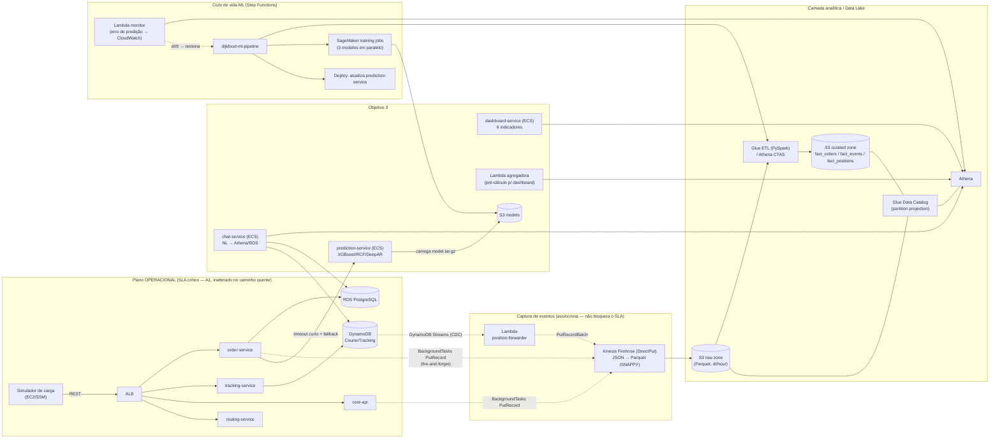

# DijkFood A2 — Arquitetura e Plano de Implementação

**Objetivo escolhido:** Objetivo 3 — *Camada preditiva e conversacional.*
**Restrições do AWS Academy Learner Lab (confirmadas):** só a `LabRole` do IAM
(não é possível criar roles/policies novas), região `us-east-1`, **sem Bedrock**
e **sem MWAA**. Serviços disponíveis e usados no projeto: **Glue/Athena,
Kinesis Data Streams + Firehose, SageMaker, Step Functions, Lambda,
DynamoDB Streams, S3, ECS Fargate, ALB, RDS**.

> Este documento cobre: (1) diagrama da arquitetura, (2) decisões de projeto
> (alternativas → escolha → justificativa) no formato exigido pelo relatório,
> (3) plano de implementação faseado em nível de arquivo, (4) melhorias de
> paralelização/escalonamento, (5) extensões do simulador e (6) riscos do
> Learner Lab com mitigação. Tudo é executável dentro do orçamento e das
> permissões do laboratório.

---

## 0. Resumo da A1 (ponto de partida)

| Componente | Tecnologia | Papel |
|---|---|---|
| `core-api` | FastAPI + FastCRUD (ECS) | CRUD de usuários, restaurantes, couriers, histórico |
| `order-service` | FastAPI (ECS) | Criação de pedidos + transições de estado (RDS) |
| `tracking-service` | FastAPI (ECS) | Posições dos couriers (DynamoDB + H3) |
| `routing-service` | FastAPI (ECS) | Cálculo de rota sobre grafo (S3 `.pkl`) |
| RDS PostgreSQL | `orders`, `orderevents`, `orderstate`, `users`, `restaurants`, `courier`, `items` |
| DynamoDB `CourierTracking` | posição/estado do courier, GSI `CellIndex` (H3) |
| ALB | roteamento por path (`/order`, `/tracking/*`, `/routes/*`, resto → core-api) |
| EC2 + SSM | executa o simulador de carga |
| Terraform + `deploy.py` | IaC + orquestração; injeta `LabRole` via `execution_role_arn`/`task_role_arn` |

**Os três eventos operacionais que a A2 exige persistir já existem na origem:**
- *Criação de pedido* → `order-service` `POST /order` (escreve `orders` + `orderevents`).
- *Transição de estado* → `order-service` `PATCH /order` (atualiza `orders.id_last_state` + insere `orderevents`).
- *Posição reportada* → `tracking-service` `POST /tracking/position` (escreve `CourierTracking`).

---

## 1. Visão geral da arquitetura A2



**Princípio central (requisito não-funcional do enunciado):** *“a operação não
poderá regredir em latência ou disponibilidade em razão dos consumidores da
camada analítica.”* Por isso o caminho operacional (RDS commit / DynamoDB write)
**nunca aguarda** a analítica:
- posições usam **CDC via DynamoDB Streams** (latência zero adicionada à escrita):
  uma Lambda lê o stream, **colapsa para a última posição por courier** e faz
  `PutRecordBatch` no Firehose;
- pedidos/transições (alto volume) usam um **emissor com fila limitada**
  (`EventEmitter`): o caminho quente só faz `put_nowait` O(1) (descarta com
  contador se a fila encher → backpressure real); um worker em background drena
  em lotes para o Firehose. **Sem chamadas de rede no caminho quente** — a
  predição é enriquecida no worker (amostrada, concorrência limitada);
- eventos de cadastro da core-api (baixo volume) usam `BackgroundTasks` simples.

> **Nota de implementação (consolidação da branch `firehose`):** adotamos
> **Firehose DirectPut** (sem Kinesis Data Stream intermediário) — mais simples
> e barato no Learner Lab — e o Firehose **converte JSON→Parquet** na entrega
> (data format conversion via schema da tabela Glue), reduzindo custo de
> armazenamento no S3 e de scan no Athena. Todos os eventos seguem **um único
> schema canônico flat** (tabela `events`), então toda a captura cai numa só
> tabela particionada por `dt`/`hour`.

---

## 2. Decisões de projeto (alternativas → escolha → justificativa)

### D1 — Como capturar eventos sem regredir o SLA?
| Alternativa | Prós | Contras | Veredito |
|---|---|---|---|
| Dual-write síncrono (serviço grava no stream no request) | simples | **+latência** no caminho quente, acopla disponibilidade | ❌ viola o NFR |
| DMS (CDC do RDS) | sem mudança de código | DMS incerto no Learner Lab, pesado, custo | ❌ risco |
| **Posições: DynamoDB Streams → Lambda; Pedidos: fila limitada → Firehose** | latência ~0 no caminho quente, backpressure por descarte | best-effort (sem replay) | ✅ **escolhido** |

### D2 — Backbone de eventos
| Alternativa | Veredito |
|---|---|
| EventBridge | bom p/ baixo volume; fan-out a 200 req/s + posições a 100 ms fica pior → ❌ |
| SQS | sem entrega nativa a S3, exige consumidor próprio → ❌ |
| Kinesis Data Streams + Firehose | shards/replay, porém **custo de shard e uma peça a mais** sem ganho p/ Obj 3 (não exige tempo real) → ⚠️ preterido |
| **Kinesis Firehose DirectPut → S3 Parquet** | serverless, **sem custo de shard**, conversão JSON→Parquet nativa, mais simples no Learner Lab → ✅ **escolhido** |

> **Revisão de decisão:** o plano inicial usava um Kinesis Data Stream antes do
> Firehose. Como o Objetivo 3 **não** exige dashboard em tempo real (isso é o
> Objetivo 1), o stream intermediário só adicionaria custo de shard e
> complexidade. Consolidamos em **Firehose DirectPut com conversão para
> Parquet** — mais barato e simples, sem perder nada para o Obj 3.

### D3 — Armazenamento durável / consultas
| Alternativa | Veredito |
|---|---|
| Redshift | data warehouse forte, **mas** caro e always-on (orçamento do lab) → ❌ |
| Só RDS | concorre com o caminho operacional, sem separação OLAP/OLTP → ❌ |
| **S3 + Glue Catalog + Athena (Parquet, partition projection)** | serverless, escala a zero, barato, separa OLAP do OLTP → ✅ **escolhido** |

### D4 — Serving de modelos preditivos
| Alternativa | Prós | Contras | Veredito |
|---|---|---|---|
| SageMaker endpoint always-on | gerenciado | custo contínuo, *pass-role* às vezes instável no lab | ⚠️ opcional |
| **prediction-service (ECS) carregando `model.tar.gz` do S3** | usa o padrão ECS+ALB já provado, controle total, integra com `order-service` com timeout curto + fallback | servir é “na mão” | ✅ **escolhido (primário)** |
| SageMaker **Serverless Inference** | escala a zero | cold start, cota do lab | ⚠️ alternativa documentada |

> **Treino sempre no SageMaker** (job efêmero → `model.tar.gz` no S3). **Serving
> desacoplado** no ECS = robustez máxima no Learner Lab sem abrir mão de usar
> SageMaker (tema do seminário ML gerenciado). O `order-service` chama o
> `prediction-service` com `timeout=0.3s` e, em falha, devolve uma estimativa
> heurística — então a predição **nunca** regride o SLA de criação de pedido.

### D5 — Capacidade conversacional **sem Bedrock**
| Alternativa | Prós | Contras | Veredito |
|---|---|---|---|
| Bedrock (LLM gerenciado) | melhor NLU | **indisponível no lab** | ❌ |
| LLM open hospedado no SageMaker (Flan-T5) p/ text-to-SQL | flexível | custo/cold start, risco de SQL inválido | ⚠️ upgrade opcional |
| **NLU por embeddings (sentence-transformers no container) + roteamento por intenção → consultas Athena/RDS parametrizadas + resposta por template** | determinístico, explicável, offline, custo zero de inferência, “com certeza funciona” | conjunto de intenções é curado | ✅ **escolhido (primário)** |

> O `chat-service` resolve pergunta em linguagem natural casando o texto
> (semanticamente, via embeddings locais) contra um catálogo de intenções; cada
> intenção mapeia para uma **consulta parametrizada segura** — *histórico* →
> Athena, *estado atual* → RDS/DynamoDB — e a resposta é renderizada por
> template. Sempre responde, nunca gera SQL inválido. Se o endpoint Flan-T5 do
> SageMaker estiver disponível, ele entra como camada de fallback para perguntas
> fora do catálogo, mantendo o parser determinístico como rede de segurança.

### D6 — Dashboard analítico (6 indicadores obrigatórios)
| Alternativa | Veredito |
|---|---|
| QuickSight | difícil de automatizar em IaC e incerto no lab → ❌ |
| **dashboard-service (FastAPI + Plotly em ECS, atrás do ALB `/dashboard*`)** consultando Athena | controle total, IaC reproduzível, mesmo padrão FastAPI dos demais serviços → ✅ **escolhido (implementado)** |

> **Implementado:** os 6 indicadores são SQL Athena sobre a tabela canônica
> `events` (sem precisar de curated zone na v1). O serviço executa as 6
> consultas em paralelo (threadpool), com cache em memória (TTL 60 s) para não
> re-escanear o lake a cada carregamento. Autoscaling por CPU. Healthcheck em
> `/healthz`. Página única com Plotly (CDN). Ver `services/dashboard-service/`.

### D7 — Orquestração do ciclo de vida ML
| Alternativa | Veredito |
|---|---|
| MWAA/Airflow | **indisponível no lab** → ❌ |
| **Step Functions** (FeatureETL → treino paralelo → avaliação → deploy → monitoramento) | serverless, usa `LabRole`, paraleliza treinos, cobre o ciclo de vida exigido → ✅ **escolhido** |

---

## 3. Camada analítica em detalhe

### 3.1 Esquema de evento canônico FLAT (tabela Glue `events`)
Um único schema atende a todos os produtores; campos ausentes viram `null` no
Parquet. `event_type` ∈ {`order_created`, `order_state_changed`,
`courier_position`, `user_created`, `restaurant_created`, `courier_created`,
`menu_item_created`}.
```json
{
  "event_type": "order_state_changed",
  "occurred_at": "2026-05-31T12:00:00.000Z",
  "city": "sao_paulo",
  "order_id": 123, "restaurant_id": 45, "user_id": 67, "courier_id": 89,
  "state_id": 2, "state_name": "PREPARING",
  "lat": -23.55, "lon": -46.63, "h3_cell": "88a8a...",
  "predicted_eta_s": 1800
}
```
Colunas: `event_type, occurred_at, city, order_id, restaurant_id, user_id,
courier_id, state_id, state_name, lat, lon, h3_cell, predicted_eta_s`.

### 3.2 Firehose → S3 (DirectPut, JSON→Parquet)
- **DirectPut** (sem Kinesis): `order-service`/`core-api` via `BackgroundTasks`
  (`put_record`) e a Lambda de posições via `put_record_batch`.
- **Conversão para Parquet** na entrega (`data_format_conversion_configuration`:
  OpenX JSON in → Parquet out, schema = tabela Glue `events`). Reduz custo de
  S3 e de scan no Athena. Compressão Parquet = SNAPPY; wrapper S3 `UNCOMPRESSED`.
- **Partição por tempo** (nativa, sem dynamic partitioning):
  `s3://<lake>/raw/dt=!{timestamp:yyyy-MM-dd}/hour=!{timestamp:HH}/`.
- Buffer 60 s / 128 MB (≥64 MB exigido p/ conversão; latência analítica ~1 min — ok p/ Obj 3).
- Tabela Glue `events` (Parquet SerDe) com **partition projection** em `dt`+`hour`.

### 3.3 Glue + Athena
- **Partition projection** nas tabelas (sem depender de crawler agendado → consultas paralelas e baratas).
- **Curated**: Glue ETL PySpark (ou Athena CTAS) materializa:
  - `fact_orders`: 1 linha/pedido com `created_at`, timestamp de cada estado, `total_delivery_time_s`, `h3_cell`, `restaurant_id`, `hour`, `dow`.
  - `fact_order_events`, `fact_positions`.

### 3.4 Os 6 indicadores (Athena sobre `fact_orders`/`fact_order_events`)
1. **Volume no tempo** — `COUNT(*) GROUP BY date_trunc('hour', created_at)`.
2. **Tempo médio por estado** — `AVG(next_ts - ts)` por `state` em `fact_order_events`.
3. **Distribuição por região** — `COUNT GROUP BY h3_cell` (+ mapa).
4. **Heatmap hora × dia** — `COUNT GROUP BY hour, dow`.
5. **Top 10 restaurantes** — `COUNT GROUP BY restaurant_id ORDER BY ... LIMIT 10`.
6. **Histograma de tempo total** — `width_bucket(total_delivery_time_s, ...)`.

Uma **Lambda agregadora** roda essas queries em janela e grava JSON em
`s3://.../dashboard/`; o dashboard lê o JSON (rápido/barato), com fallback de
query ao vivo.

---

## 4. Camada preditiva (SageMaker) e seu ciclo de vida

| Modelo | Algoritmo | Entrada (features do data lake) | Uso |
|---|---|---|---|
| **Tempo de entrega** | XGBoost (built-in) | restaurante, h3, hora, dow, distância, nº couriers disponíveis | no `POST /order` (ETA) |
| **Demanda por região/hora** | DeepAR ou XGBoost c/ lags | série de pedidos por h3 × hora | planejamento/alertas |
| **Anomalias operacionais** | Random Cut Forest (built-in) | pedidos/min por região, desvio de ETA | detecção em near-real-time |

**Ciclo de vida (Step Functions `dijkfood-ml-pipeline`):**
1. **Coleta** — eventos já caem no S3 (Seção 3).
2. **Feature engineering** — passo Glue/Athena CTAS gera datasets de treino em `s3://.../features/`.
3. **Treino** — 3 *training jobs* SageMaker **em paralelo** (`Parallel` state), `LabRole` como execution role; saída `model.tar.gz` em `s3://.../models/<modelo>/`.
4. **Avaliação** — passo calcula métrica (RMSE/MAPE) e só promove se passar do *baseline*.
5. **Deploy** — atualiza o `prediction-service` (recarrega artefato do S3 / force-new-deployment ECS).
6. **Monitoramento** — Lambda compara ETA previsto × tempo real de pedidos concluídos (do data lake), publica `prediction_mae` no CloudWatch; *drift* dispara o passo 1.

> **SLA preservado (implementado):** a predição roda **no worker do emissor**
> (não no caminho quente), de forma **amostrada e com concorrência limitada
> (semáforo)** — o `POST /order` só faz `put_nowait` O(1). A chamada ao
> `prediction-service` tem timeout de 300 ms; qualquer falha →
> `predicted_eta_s=null` (enriquecimento, nunca caminho crítico). O ETA previsto
> é gravado no evento `order_created`, permitindo o monitoramento previsto × real.
>
> **Implementado (v1):** o `prediction-service` (ECS, `/predict*`) treina o
> modelo de **tempo de entrega** com `HistGradientBoostingRegressor`
> (scikit-learn) a partir de features do Athena, persiste em
> `s3://<datalake>/models/...` e serve `/predict/delivery-time`. Endpoints de
> ciclo de vida: `POST /predict/train` (re-treino) e `GET /predict/metrics`
> (MAE previsto × real). `deploy.py train` dispara o re-treino.
>
> **Evolução (Fase 3b):** mover o treino para *training jobs* SageMaker
> orquestrados por Step Functions (3 modelos em paralelo), mantendo o serving no
> ECS. Demanda (DeepAR) e anomalias (RCF) entram aqui.

---

## 5. Camada conversacional (sem Bedrock)

`chat-service` (ECS, `/chat`):
1. **NLU** — `sentence-transformers` (modelo pequeno empacotado na imagem → offline, sem custo de inferência) gera embedding da pergunta e casa contra o catálogo de intenções (ex.: *volume de pedidos*, *top restaurantes*, *entregadores disponíveis agora*, *tempo médio de entrega na região X*, *pedidos por estado agora*).
2. **Slots** — extrai período, região (h3/bairro), restaurante, estado.
3. **Roteamento** — *estado atual* → RDS/DynamoDB; *histórico/agregado* → Athena. Consultas **parametrizadas** (sem SQL livre → seguro).
4. **Resposta** — template em PT-BR com os números retornados.

Exemplos que ele responde: “quantos pedidos foram entregues ontem?”, “qual o
restaurante com mais pedidos esta semana?”, “quantos entregadores estão
disponíveis agora?”, “tempo médio de entrega na zona sul hoje?”.

> Upgrade opcional: endpoint Flan-T5 (SageMaker JumpStart) para text-to-SQL de
> perguntas fora do catálogo, com o parser determinístico como fallback.

---

## 6. Paralelização e escalonamento (pedido explícito)

| # | Melhoria | Status |
|---|---|---|
| 1 | **DynamoDB `CourierTracking` → `PAY_PER_REQUEST`** (era PROVISIONED 10/10 — gargalo a 200 req/s) | ✅ feito |
| 2 | **Atribuição atômica de courier** — *conditional update* DynamoDB (claim AVAILABLE→BUSY); resolve a corrida do `#TODO` | ✅ feito (`/tracking/claim`) |
| 3 | **Emissão com fila limitada + flush em lote** (backpressure por descarte) → analítica nunca bloqueia/atrasa o request | ✅ feito (`events.py`) |
| 4 | **Colapso de posições por courier na Lambda** + janela de batching ampla → corta volume/custo no Firehose | ✅ feito (`position-forwarder`) |
| 5 | **DynamoDB Streams** consumido por Lambda em paralelo por shard | ✅ feito |
| 6 | **Athena partition projection + Parquet** → scans paralelos e baratos | ✅ feito |
| 7 | **Autoscaling ECS** (CPU/ALBRequestCount) nos serviços; `prediction` fixo em 1 (modelo em memória) | ✅ feito |
| 8 | **Treino paralelo** dos 3 modelos (`Parallel` no Step Functions) | ⏳ Fase 3b |
| 9 | **Lambda de pré-agregação** → dashboard não re-escaneia o lake | ⏳ opcional |
| 10 | **SageMaker Serverless Inference** (escala a zero) como opção de serving | ⏳ opcional |

---

## 7. Extensão do simulador (requisito)

Cenários atuais (`testing/normal/peak/event`) mantidos. Novos parâmetros de
cenário operacional:
- `HOTSPOT_H3` + `HOTSPOT_WEIGHT` — **aumento de demanda numa região** (enviesa `random.choice` de coordenadas/usuários).
- `HOTSPOT_RESTAURANTS` + `HOTSPOT_RESTAURANT_WEIGHT` — **concentração de pedidos** em restaurantes específicos.
- `COURIER_AVAILABILITY_FACTOR` (0–1) — **redução temporária de entregadores** (popula menos couriers / marca parte como BUSY).
- `GROUND_TRUTH_LOG` — registra tempo real de entrega por pedido para medir a acurácia do preditor.

Mantém os volumes A1 (normal/pico/evento) e adiciona um `report` com métricas por
região e por restaurante (para evidenciar os cenários).

---

## 8. IaC e deploy

**Novos módulos Terraform:** `kinesis`, `firehose`, `glue`, `athena`,
`lambda`, `stepfunctions`, `sagemaker` (endpoint opcional); **novas task defs
ECS** (`prediction-service`, `chat-service`, `dashboard-service`) + **regras
ALB** (`/predict/*`, `/chat`, `/dashboard/*`); DynamoDB com stream habilitado e
billing on-demand.

> **Tudo usa a `LabRole`.** O `deploy.py` já a descobre e injeta como
> `execution_role_arn`/`task_role_arn`. Adicionar `var.lab_role_arn` e passá-la
> a Lambda/Firehose/Glue/SageMaker/Step Functions (todos aceitam role
> pré-existente — não criamos IAM novo).

**`deploy.py` estendido:** build/push das 3 novas imagens; empacotar zips das
Lambdas; alvos novos `analytics-bootstrap` (cria Glue DB/tabelas) e `ml-train`
(dispara Step Functions); novos `SCENARIO`s no `simulate`.

---

## 9. Plano de implementação faseado

> Ordem pensada para que cada fase seja **deployável e demonstrável**
> isoladamente (bom para os Ciclos 2 e 3).

**Fase 1 — Backbone de eventos + Data Lake (base obrigatória) — ✅ FEITO**
- `modules/datalake` (S3 + Firehose DirectPut **JSON→Parquet** + Glue DB/tabela `events` + Athena workgroup).
- DynamoDB: stream + `PAY_PER_REQUEST`; Lambda `position-forwarder` (CDC → Firehose).
- `order-service`/`core-api`: dispatch assíncrono (`BackgroundTasks`) → Firehose, schema canônico flat.
- *Saída demonstrável:* eventos chegando como Parquet no S3, consultáveis no Athena.

**Fase 2 — Dashboard analítico (6 indicadores) — ✅ FEITO**
- `dashboard-service` (FastAPI + Plotly, ECS) consultando Athena; regra ALB `/dashboard*`; autoscaling por CPU.
- 6 indicadores como SQL Athena sobre `events` (`services/dashboard-service/src/queries.py`).
- *Pendente opcional:* Lambda de pré-agregação para reduzir scans sob acesso intenso.

**Fase 3 — Camada preditiva + ciclo de vida — ✅ FEITO (v1)**
- `prediction-service` (ECS, `/predict*`): treina HistGradientBoostingRegressor a partir do Athena, persiste no S3, serve `/predict/delivery-time`.
- Ciclo de vida: `/predict/train` (coleta→treino→deploy) e `/predict/metrics` (monitoramento MAE); `deploy.py train`.
- Integração `order-service` → `prediction-service` em BackgroundTask (timeout 300 ms, fallback null); `predicted_eta_s` gravado no evento.
- *Fase 3b (pendente):* treino em SageMaker via Step Functions; modelos de demanda (DeepAR) e anomalia (RCF).

**Fase 4 — Camada conversacional**
- `chat-service` (ECS) com NLU por embeddings + consultas parametrizadas.

**Fase 5 — Simulador + endurecimento + relatório**
- Novos cenários, claim atômico de courier, autoscaling das novas services.
- Resultados experimentais (latência operacional estável com analítica ligada vs. desligada; acurácia do preditor; cenários de hotspot).

---

## 10. Riscos do Learner Lab e mitigação

| Risco | Mitigação |
|---|---|
| `pass-role`/endpoint SageMaker instável | serving primário no ECS (D4); SageMaker só p/ treino (job efêmero) |
| Bedrock indisponível | conversacional determinístico por embeddings locais (D5) |
| Orçamento | tudo serverless/escala-a-zero; treino efêmero; sem Redshift; sem endpoint always-on; `destroy` automático |
| Sessão do lab expira (4 h) | Step Functions e jobs idempotentes; `deploy.py` re-entrante |
| Só `LabRole` | nenhum IAM novo; toda compute recebe a `LabRole` existente |
| Cota de shards/Lambda | dimensionar shards ao volume do cenário; `PutRecords` em lote |

---

## 11. Critérios de aceite (mapeados ao enunciado)

- [x] Camada analítica durável dos 3 tipos de evento (S3/Glue/Athena via Kinesis/CDC).
- [x] Dashboard com os 6 indicadores mínimos.
- [x] Objetivo 3: preditiva (3 modelos) + conversacional (NL → estado/histórico).
- [x] Ciclo de vida explícito (coleta→treino→deploy→monitoramento) via Step Functions.
- [x] **Sem regressão de SLA** (CDC + emissão assíncrona + timeout/fallback).
- [x] Simulador parametrizável (hotspot de região/restaurante, escassez de courier).
- [x] IaC estendido (`deploy.py`/Terraform), automação de implantação.
- [x] Melhorias de paralelização/escalonamento (Seção 6).
